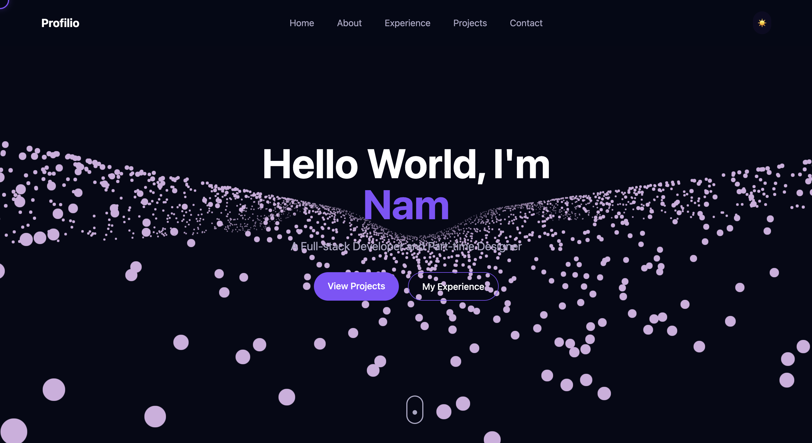

# Portfolio Website

A 3D interactive portfolio website built with React, Three.js, and Node.js. This full-stack application showcases projects, skills, and work experience with dynamic content management and modern interactive UI elements.



## Features

- Interactive 3D elements using Three.js
- Dynamic animations with Framer Motion and GSAP
- Responsive design with mobile and desktop layouts
- Dark/light theme with smooth transitions
- GitHub project showcase with live API integration
- Skill visualization with interactive 3D elements
- Experience timeline with scroll animations
- Contact form with validation and email integration
- Admin dashboard for managing content
- PostgreSQL database with Prisma ORM
- Docker containerization for easy deployment

## Tech Stack

### Frontend
- React 19
- TypeScript
- Three.js / React Three Fiber
- Framer Motion for UI animations
- GSAP for advanced animations
- Tailwind CSS for styling
- Vite for fast builds and development

### Backend
- Node.js
- Express.js REST API
- PostgreSQL database
- Prisma ORM for type-safe database access
- JWT authentication for admin access

### DevOps
- Docker & Docker Compose
- GitHub Actions for CI/CD
- Nginx for serving static assets
- PostgreSQL containerization

## Live Demo

View the live site: 

## Development

### Prerequisites
- Node.js (v20+)
- Docker and Docker Compose (for containerized development)
- PostgreSQL (if running locally without Docker)
- Git

### Installation

1. Clone the repository
   ```bash
   git clone https://github.com/namdavid2904/profilio.git
   cd profilio
   ```

2. Install dependencies

   a. Install root dependencies
   ```bash
   npm install
   ```
   
   b. Install client dependencies
   ```bash
   cd client && npm install
   ```
   
   c. Install server dependencies
   ```bash
   cd ../server && npm install
   ```

3. Set up environment variables

   a. Client
   ```bash
   cp client/.env.example client/.env
   ```
   
   b. Server
   ```bash
   cp server/.env.example server/.env
   ```

4. Set up PostgreSQL
   
   a. Using Docker
   ```bash
   docker run --name portfolio-postgres -e POSTGRES_PASSWORD=password -e POSTGRES_USER=postgres -e POSTGRES_DB=portfolio -p 5432:5432 -d postgres:14
   ```
   
   b. Using local PostgreSQL
   
   This can be done by creating database named "portfolio"

5. Run database migrations
   ```bash
   cd server
   npm run migrate
   ```

### Running the Application

#### Development Mode

1. Start the server
   ```bash
   cd server
   npm run dev
   ```

2. In a new terminal, start the client
   ```bash
   cd client
   npm run dev
   ```

3. Access the application at http://localhost:3000

#### Using Docker Compose

Run the entire application stack with:

```bash
docker-compose up -d
```

This will start:
- Client on http://localhost:3000
- Server on http://localhost:5000
- PostgreSQL database

### Building for Production

1. Build the client
   ```bash
   cd client
   npm run build
   ```

2. Build the server
   ```bash
   cd server
   npm run build
   ```

3. Using Docker
   ```bash
   docker-compose -f docker-compose.yml -f docker-compose.prod.yml up -d
   ```

## Project Structure

```
.github/            # GitHub Actions workflows
.gitignore          # Git ignore rules
client/             # Frontend React application
  ├── public/         # Static assets
  │   ├── assets/     # Images and icons
  │   ├── fonts/      # Custom fonts
  │   ├── models/     # 3D models
  │   └── textures/   # 3D textures
  ├── src/            # Source code
  │   ├── api/        # API client
  │   ├── components/ # React components
  │   ├── context/    # React context providers
  │   ├── hooks/      # Custom React hooks
  │   ├── pages/      # Page components
  │   └── styles/     # CSS styles
docker/             # Docker configuration
  ├── Dockerfile.client
  └── Dockerfile.server
server/             # Backend Express application
  ├── prisma/         # Database schema and migrations
  └── src/            # Source code
      ├── controllers/ # API controllers
      ├── middlewares/ # Express middlewares
      ├── models/      # Data models
      ├── routes/      # API routes
      └── utils/       # Utility functions
shared/             # Shared code between client and server
```

## API Documentation

The API documentation is available at `/api/docs` when running the server.

### Main Endpoints

- `GET /api/projects` - Get all projects
- `GET /api/experiences` - Get work experience
- `GET /api/skills` - Get skills by category
- `POST /api/contact` - Send contact message

## Authentication

Admin dashboard access requires authentication:

```bash
POST /api/auth/login
{
  "email": "admin@example.com",
  "password": "password"
}
```

## Testing

### Running Client Tests

```bash
cd client
npm test
```

### Running Server Tests

```bash
cd server
npm test
```

## Contributing

1. Fork the repository
2. Create a feature branch: `git checkout -b feature-name`
3. Commit changes: `git commit -m 'Add some feature'`
4. Push to the branch: `git push origin feature-name`
5. Submit a pull request

## License

This project is licensed under the MIT License - see the LICENSE file for details.

## Acknowledgements

- Three.js for 3D graphics capabilities
- React Three Fiber for React integration with Three.js
- Framer Motion for animation system
- Tailwind CSS for utility-first styling
- Prisma team for the excellent ORM

## Contact

Nam Pham - [namphamphuong906@gmail.com](mailto:namphamphuong906@gmail.com)

Project Link: [https://github.com/namdavid2904/profilio](https://github.com/namdavid2904/profilio)

